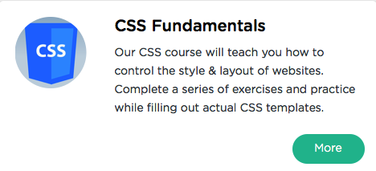

```
Roberto Nogueira  
BSd EE, MSd CE
Solution Integrator Experienced - Certified by Ericsson
```
# Sololearn Css



**About This Tutorial**

Our CSS tutorial is a learning game that will teach you how to set and control the style and layout of a website.

Watch our carefully selected YouTube Videos, take the interactive quizzes, accumulate checkpoints, complete entertaining exercises, collect colorful points, and practice filling out actual CSS templates. Whether you want to gain a new skill to further your career, or just want to learn something new, we guarantee that you will enjoy learning while playing and playing while learning with our CSS tutorial!

[Sololearn Css](https://www.sololearn.com/Play/CSS)

#### Topics
```
Css Fundamentals
[x] The Basics
[x] Working with Text
[x] Properties
[ ] Positioning and Layout
[ ] CSS3 Basics
[ ] Gradients and Backgrounds
[ ] Transitions & Transforms
[ ] Certificate
```

